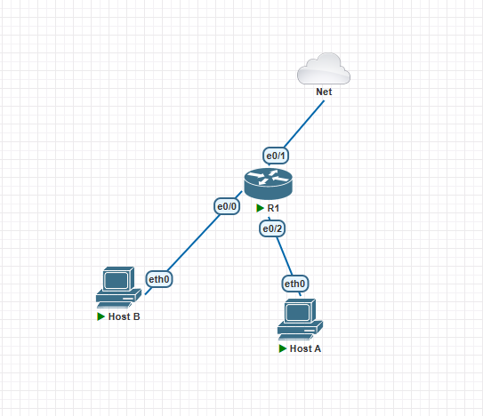

Disciplina: **ENE0011 – Laboratório de Redes**  
Curso: **Engenharia de Redes de Comunicação**  
Instituição: **Universidade de Brasília (UnB)**  
Departamento: **Engenharia Elétrica** 

Professor Responsável: **Prof. Dr. Laerte Peotta de Melo**

# Relatório do Experimento "Introdução aos Dispositivos de Redes"

## Identificação
- Nome: Matheus Lacerda da Silveira
- Matrícula: 201000136
- Turma: Tópicos Protocolos Redes

## Objetivo
- Compreender que redes distintas não se comunicam automaticamente
- Identificar o papel do roteador como elemento lógico de interconexão
- Diferenciar falha de comunicação por ausência de roteamento de falha física
- Relacionar teoria de roteamento com comportamento real da rede

## Ambiente experimental

Discussão orientada
O enlace físico funciona?

O IP está configurado corretamente?

Por que o pacote não chega ao Host B?

Conclusão: Sem uma decisão de encaminhamento, o pacote não sabe para onde ir.

## Procedimentos
1. Primeiramente, foram adicionados todos os nodes necessários para realizar o experimento, no caso foram:
- um roteador CISCO IOL
- dois VPCs

2. Depois os dispositivos foram conectados da seguinte forma abaixo, onde o roteador faz o gerenciamento das rotas:

3. Foi feito a configuração do roteador das interfaces de rede

4. Um teste de ping (conexão) foi executado entre o Host A e o roteador como pode ver na imagem abaixo.

5. Ao ver que mesmo com o roteador configurado e os enlaces físicos conectados corretamente a conexão não foi estabelecida, foi realizado a adição do default gateway para que o Host A soubesse para onde encaminhar o pacote

6. Após a adição 
## Resultados e evidências
(incluir prints e tabelas em \`relatorio/figuras/\`)

## Análise técnica
(interpretação dos resultados)

## Conclusão

## Comandos
- configure terminal

interface Ethernet0/2
 ip address 192.168.10.1 255.255.255.0
 no shutdown

interface Ethernet0/0
 ip address 192.168.20.1 255.255.255.0
 no shutdown

- ping 192.168.20.10
- show
- ip 192.168.10.10/24 192.168.10.1
- show
- ping 192.168.20.10
